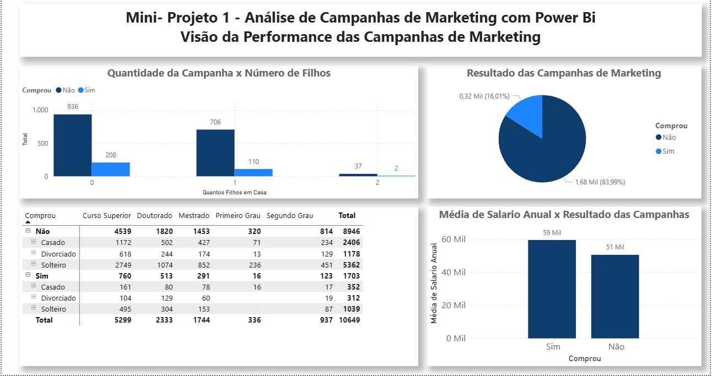
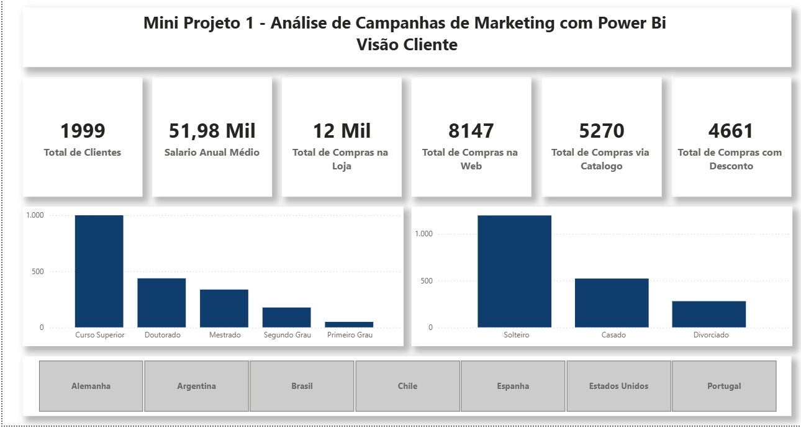
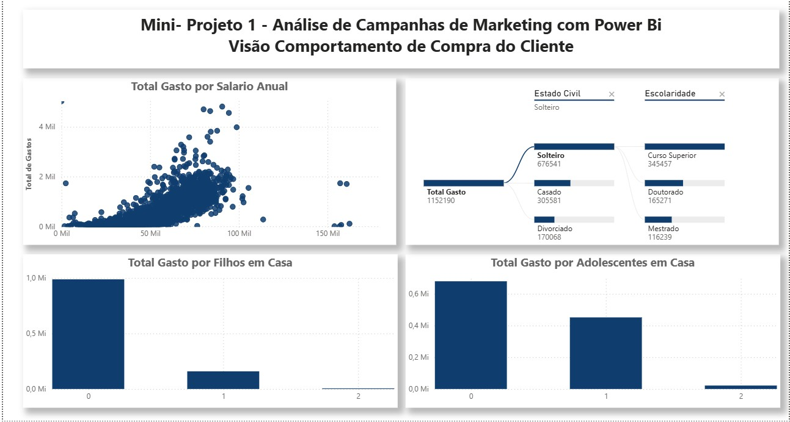
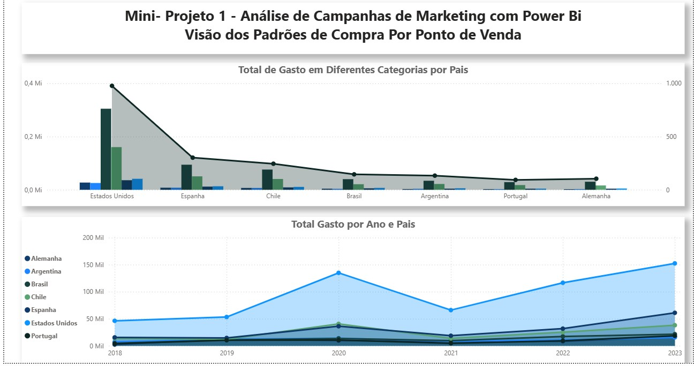

# 📊 Análise de Campanhas de Marketing | Power BI

Projeto desenvolvido em Power BI com foco na análise de performance de campanhas de marketing, comportamento do cliente e padrões de compra, visando gerar insights estratégicos para tomada de decisão.

---

## 📚 Contexto do Projeto

Projeto desenvolvido durante o curso de Power BI da Data Science Academy (DSA), com aplicação prática de ETL, modelagem de dados e DAX, incluindo adaptações e análises próprias focadas em insights de negócio.

---

## 📷 Preview

### 📊 Performance das Campanhas

### 👥 Perfil do Cliente

### 🧠 Comportamento de Compra

### 🌍 Padrões por Região

---

## 🎯 Objetivo

Avaliar a efetividade das campanhas de marketing, identificar padrões de comportamento dos clientes e entender fatores que influenciam a conversão de compras.

---

## ❓ Perguntas de Negócio

### 1. Qual o perfil de cliente com maior probabilidade de compra?

* Clientes com maior escolaridade (Curso Superior) apresentam maior volume de compras
* Clientes solteiros representam a maior base de compradores

👉 Indica que campanhas podem ser mais eficientes quando direcionadas a perfis específicos.

---

### 2. Existe relação entre renda e conversão de compras?

* Clientes que compraram possuem média salarial maior (~59 mil)
* Clientes que não compraram apresentam média menor (~51 mil)

👉 A renda influencia diretamente o comportamento de compra.

---

### 3. Como a estrutura familiar impacta o consumo?

* Clientes sem filhos concentram maior volume de compras
* O consumo diminui conforme aumenta o número de filhos

👉 Indica mudança de comportamento com aumento de responsabilidades.

---

### 4. Quais regiões apresentam maior potencial de consumo?

* Estados Unidos lidera em volume de gastos
* Outras regiões apresentam menor intensidade de consumo

👉 Permite direcionamento estratégico de campanhas por região.

---

## 📈 Principais Insights

* A maioria dos clientes não converte (~84%)
* Clientes com maior renda têm maior propensão à compra
* Estrutura familiar impacta diretamente o consumo
* Existe concentração de consumo em regiões específicas

---

## 🧠 Ferramentas e Técnicas Utilizadas

### 🔹 Power Query (ETL)

* Limpeza e transformação dos dados
* Padronização de informações
* Preparação da base analítica

---

### 🔹 Modelagem de Dados

* Estrutura em modelo estrela
* Relacionamento entre tabelas de clientes, campanhas e vendas
* Otimização de performance

---

### 🔹 DAX (Cálculos)

Utilizado para criação de métricas como:

* Taxa de conversão (Comprou vs Não Comprou)
* Média salarial por grupo
* Total de gastos por cliente
* Segmentações por perfil

---

### 🔹 Visualizações Utilizadas

* 📊 Gráfico de barras → comparação entre grupos
* 🍩 Gráfico de pizza → proporção de conversão
* 📈 Gráfico de linha → evolução temporal
* 🗺️ Mapa → distribuição geográfica
* 🎯 Segmentações → filtros dinâmicos

---

## 💡 Por que esses indicadores?

Os KPIs foram escolhidos para responder diretamente às decisões de marketing:

* **Conversão (Comprou / Não Comprou)** → eficiência das campanhas
* **Renda (Salário)** → poder de compra
* **Estrutura familiar** → comportamento de consumo
* **Geografia** → estratégia regional
* **Perfil do cliente** → segmentação

👉 Esses indicadores permitem entender **quem compra, por que compra e onde investir**

---

## 📁 Arquivos do Projeto

* `dashboard.pbix` → Arquivo Power BI
* `VisaoCampanhas.jpg` → Aba 1
* `VisaoCliente.jpg` → Aba 2
* `VisaoComportamento.jpg` → Aba 3
* `VisaoPontos.jpg` → Aba 4

---

## 🛠️ Tecnologias Utilizadas

* Power BI
* DAX
* Power Query
* Modelagem de Dados

---

## 👨‍💻 Autor

Thiago Sperate 😎
Analista de Dados 📊

📎 [LinkedIn](https://www.linkedin.com/in/thiagosperate/)
📁 [Portfólio](https://github.com/ThSperate)
